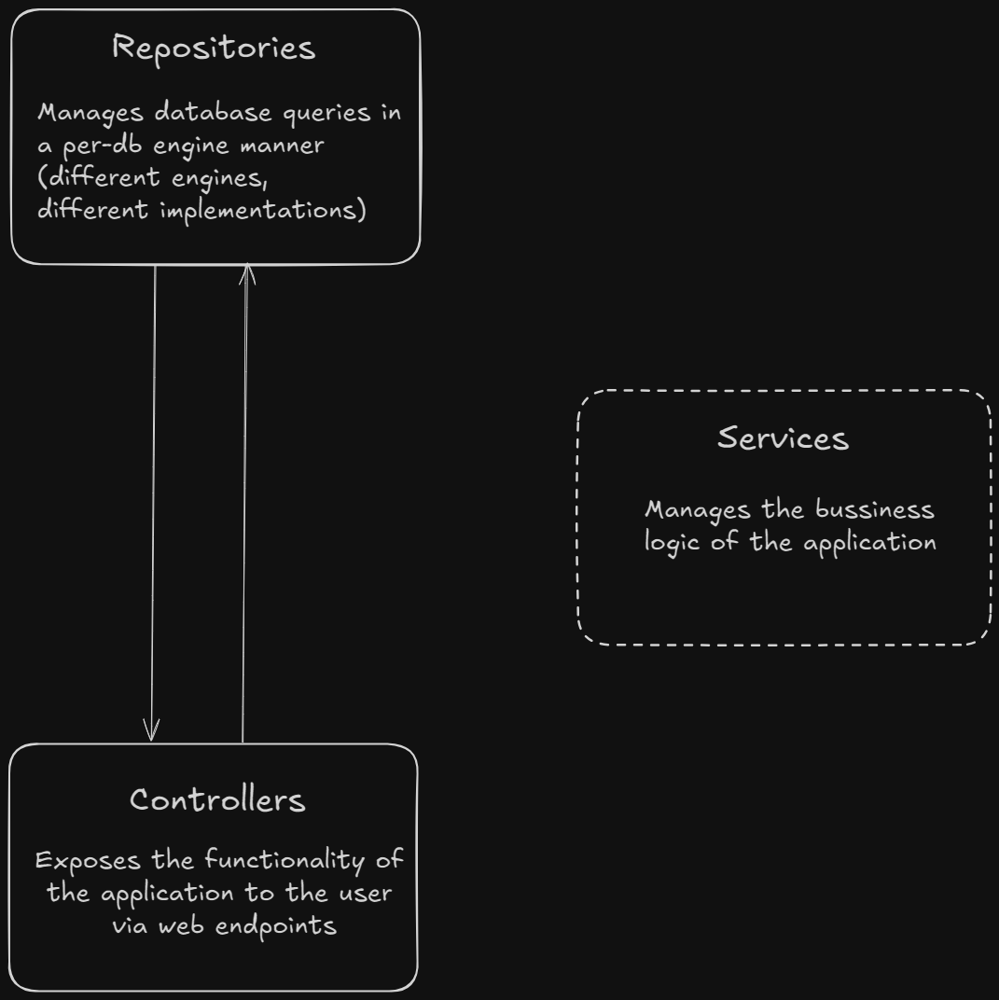
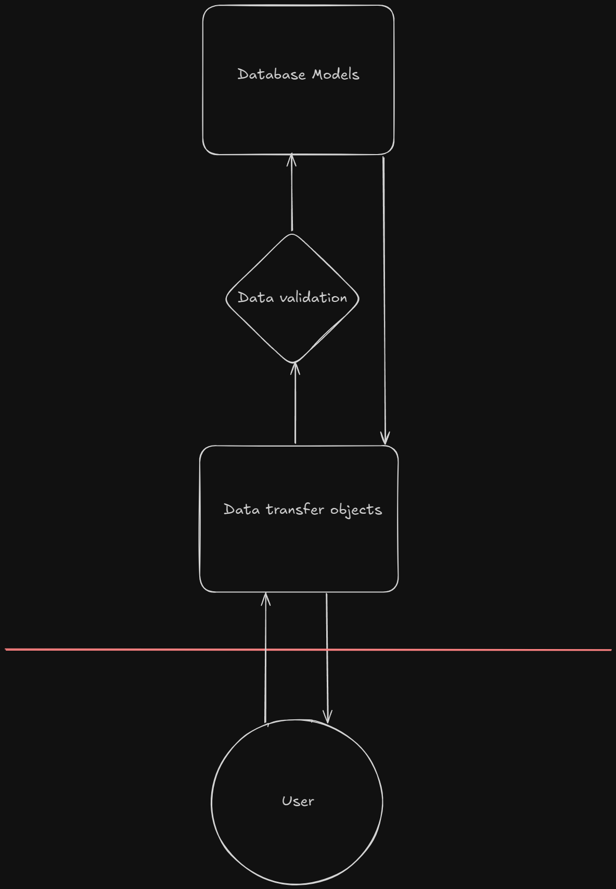
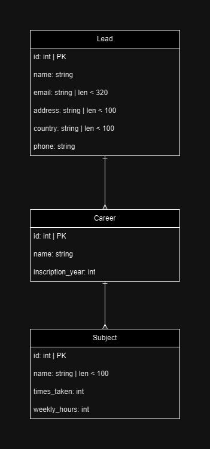

# Lead Manager

- [Preface](#preface)
- [Design patterns](#design-patterns)
   * [Layers in this application](#layers-in-this-application)
   * [Why use DTOs](#why-use-dtos)
- [Database ER diagram](#database-er-diagram)
- [Requirements](#requirements)
- [Production](#production)
- [Development](#development)
- [API Documentation](#api-documentation)
- [Whats missing](#whats-missing)

## Preface

Regarding the main assignment:

* The assignment specifies `N` subjects and `N` careers, meaning students or 'leads' are taking the same 
amount of classes as careers they are pursuing. I'll assume `Ns (N of subjects) != Nc (N of careers)` as it wouldn't make much sense otherwise. 

* It also defines N as: `[0, N] ^ [N, X]` but `X` is not defined. I'll assume `X = inf`.

Regarding the installation:

This guide assumes you are using a debian based distribution

## Design patterns

### Layers in this application

A simple controller -> repository pattern is used. The service layer (the layer that manages the bussiness logic of the application) was omitted as there was no bussiness logic at all to implement.

### Why use DTOs

DTOs are a great way to decouple the data access layer from the rest of the application, as it provides an intermediate format to transfer queried data, and to also validate new objects that may or may not comply with the validation rules of the application. This also allows us to hide certain fields that we may not want users to see and avoid circular references (i.e. related entities that contain each other).

## Database ER diagram

## Requirements

* [Docker](https://docs.docker.com/engine/install/)

## Production

* Create a .env file in the root directory with the following parameters:
    * `POSTGRES_PASSWORD={YOUR_POSTGRES_PASSWORD}`
    * `PG_HOST=database`

## Development

* Install [python 3.10.12](https://www.python.org/downloads/)
* Create a virtual environment running `python3 -m venv venv`
* Activate virtual environment running `source venv/bin/activate`
* Install requirements with `pip install -r requirements.txt`
* Create a .env file in the backend folder containing the following parameters:
    * environment=test

* Run application with `uvicorn app:app --forwarded-allow-ips='*' --host 0.0.0.0 --workers 3 --reload --env-file .env` (remember to `cd` in the `backend` directory)

## API Documentation

For an interactive API documentation you can go to `localhost:8000/docs` (replace localhost for the URL of the server in case you are running it somewhere else)

## Whats missing

* Unit testing for repositories
* Bussiness logic layer between the Controller and Repository layers if needed

<!-- Index (table of contents) generated with https://github.com/derlin/bitdowntoc -->
